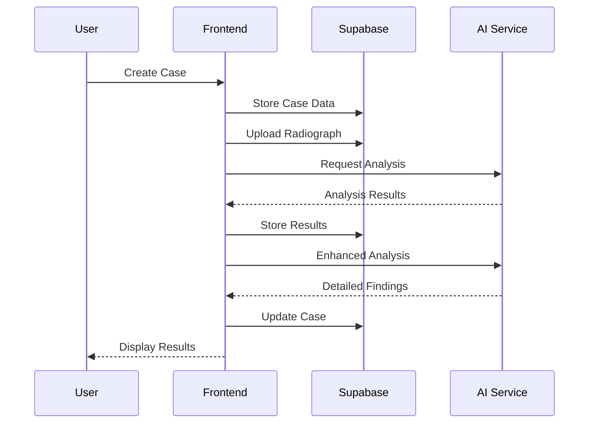
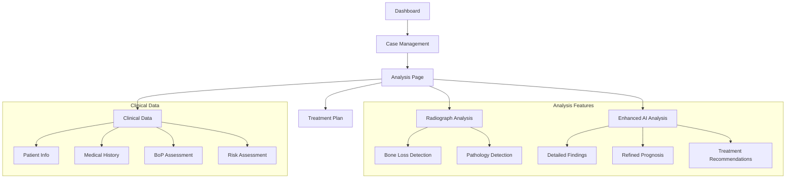

# Denti AI Sight

A sophisticated dental analysis application that leverages AI to assist dental professionals in analyzing radiographs and managing patient cases.

## 🌟 Features

### Core Functionality
- 📊 Patient Case Management
- 🔍 Radiograph Analysis
- 🤖 Enhanced AI Analysis
- 📝 Clinical Data Recording
- 🎯 Treatment Planning

### Detailed Analysis Capabilities
- Automated bone loss detection
- Periodontal staging
- Pathology detection
- Risk assessment
- AI-powered detailed findings

### Clinical Data Management
- Comprehensive patient demographics
- Medical history tracking
- Bleeding on Probing (BoP) assessment
- Clinical measurements
- Risk factor analysis

## 🏗️ Technical Architecture

### Backend Infrastructure
- **Database & Auth**: Supabase
- **Main Tables**:
  - `cases`: Core case information
  - `patient_data`: Patient demographics and history
  - `clinical_data`: Clinical measurements and assessments
  - `analysis_results`: AI analysis outputs

### Frontend Stack
- React with TypeScript
- Modern UI components
- Real-time updates
- Robust error handling
- Rate limiting with cooldown management

## 🔒 Security Features
- User authentication
- Permission-based access control
- Secure data storage
- Protected API endpoints

## 💫 User Experience
- Intuitive case management interface
- Real-time analysis feedback
- Progress indicators
- Error notifications
- Cooldown indicators for rate-limited features

## 🔄 Data Flow



## 🗺️ Component Structure



## 🚀 Getting Started

### Prerequisites
- Node.js (v14 or higher)
- npm or yarn
- Supabase account

### Installation
1. Clone the repository:
```bash
git clone https://github.com/yourusername/denti-ai-sight.git
```

2. Install dependencies:
```bash
cd denti-ai-sight
npm install
```

3. Set up environment variables:
```bash
   cp .env.example .env
   ```
   Fill in your Supabase credentials and other required variables.

4. Start the development server:
```bash
npm run dev
```

## 📝 Environment Variables
Create a `.env` file with the following variables:
```env
VITE_SUPABASE_URL=your_supabase_url
VITE_SUPABASE_ANON_KEY=your_supabase_anon_key
VITE_AI_SERVICE_URL=your_ai_service_url
```

## 🛠️ Development

### Code Structure
```
src/
├── components/        # Reusable UI components
├── pages/            # Main application pages
├── lib/              # Utilities and services
│   ├── services/     # API and service integrations
│   └── supabase.ts   # Supabase client configuration
├── types/            # TypeScript type definitions
└── styles/           # Global styles and themes
```

### Key Components
- **Dashboard**: Main interface for case management
- **Analysis**: Comprehensive analysis workspace
- **Clinical Data Forms**: Patient and clinical data entry
- **Enhanced Analysis**: AI-powered detailed analysis

## 🤝 Contributing
1. Fork the repository
2. Create your feature branch (`git checkout -b feature/AmazingFeature`)
3. Commit your changes (`git commit -m 'Add some AmazingFeature'`)
4. Push to the branch (`git push origin feature/AmazingFeature`)
5. Open a Pull Request

## 📄 License
This project is licensed under the MIT License - see the [LICENSE](LICENSE) file for details.

## 🙏 Acknowledgments
- Supabase for backend infrastructure
- React and TypeScript communities
- All contributors and users of Denti AI Sight

## 📞 Support

For support, please email support@dentiai.com or open an issue in the repository.

## 🔄 Updates

The project is actively maintained and regularly updated with new features and improvements. Check the releases page for the latest updates.
